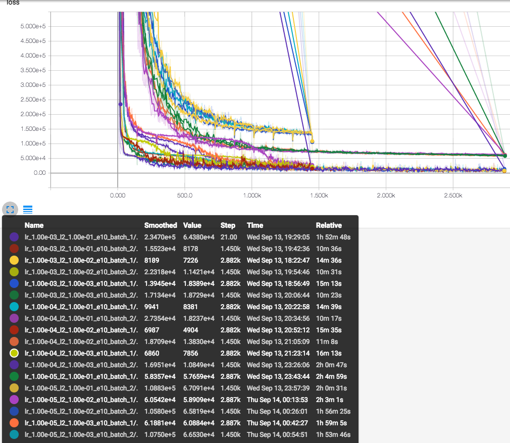

# Semantic Segmentation
## Introduction
In this project, you'll label the pixels of a road in images using a Fully Convolutional Network (FCN).

## Setup
### Frameworks and Packages

Make sure you have the following is installed:
 - [Python 3](https://www.python.org/)
 - [TensorFlow](https://www.tensorflow.org/)
 - [NumPy](http://www.numpy.org/)
 - [SciPy](https://www.scipy.org/)

Miniconda were applied to install this environment. First an `environment.yml` were used to define the versions of the packages.

```yml
name: carnd-term3
channels:
    - https://mirrors.tuna.tsinghua.edu.cn/anaconda/pkgs/free/
dependencies:
    - python==3.5.2
    - numpy==1.12.1
    - matplotlib==2.0.1
    - jupyter==1.0.0
    - opencv
    - tqdm
    - scikit-learn==0.18.1
    - scikit-image==0.13.0
    - scipy==0.19.0
    - h5py==2.7.0
    - seaborn==0.7.1
    - pandas==0.20.1
    - tensorflow-gpu==1.2.1
    - pip:
        - keras==2.0.4
        - pydot==1.2.3
        - graphviz==0.7.1
        - moviepy=0.2.3.2
```

Then create the environment:

```bash
conda env create -f=environment.yml --name carnd-term3 --debug -v -v
```

Finally, the environment were accessible using the `source` command:

```bash
source activate carnd-term3
```


### Dataset
Download the [Kitti Road dataset](http://www.cvlibs.net/datasets/kitti/eval_road.php) from [here](http://www.cvlibs.net/download.php?file=data_road.zip).  Extract the dataset in the `data` folder.  This will create the folder `data_road` with all the training a test images.

### Build the Neural Network

#### Does the project load the pretrained vgg model?

The function `load_vgg` is passed for the unittest.

### Does the project learn the correct features from the images?

The function `layers` is passed for the unittest.

#### Does the project optimize the neural network?

The function `optimize` is passed for the unittest.

#### Does the project train the neural network?

The function train_nn is passed for the unittest.

### Neural Network Training

#### Does the project train the model correctly?

On average, the model decreases loss over time.



The detailed explanation for the three lines were described in the next section.

#### Does the project use reasonable hyperparameters?

The number of epoch and batch size are set to a reasonable number.

I tried three groups of hyperparameters for the training process of this project:

name | parameter
---|---
name1 | eproch=50,learning_rate=0.001,no regularzation
name2 | eproch=50,learning_rate=0.001,l2-regularzation=0.001
name3 | eproch=100,learning_rate=0.0001,l2-regularzation=0.001

In name3, as the low `learning_rate` would result in a slower decreasing of the loss function, more eproches were given in this case.

Lastly, as I used a 12GB GPU for training, `batch_size` were used as 16 and the memory-size is 11G in this case, which would make the best use of the GPU resource.


#### Does the project correctly label the road?

The project labels most pixels of roads close to the best solution. The model doesn't have to predict correctly all the images, just most of them.

A solution that is close to best would label at least 80% of the road and label no more than 20% of non-road pixels as road.

Some examples:


Also, a video of udacity term1 project 4 were also used to test the model. See in this link:

- Youtube link[https://youtu.be/eGrev0uLS4k](https://youtu.be/eGrev0uLS4k)
